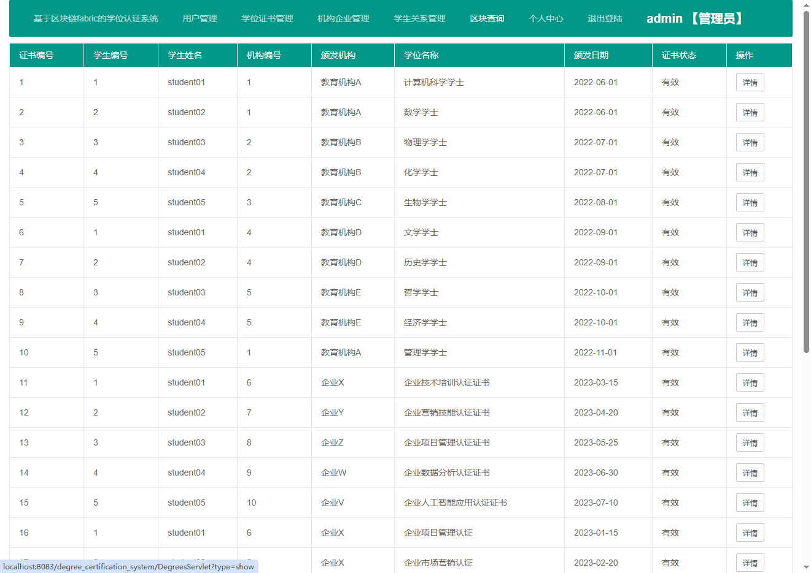

# degree_certification_system
基于区块链fabric的学位认证系统,角色包括：学生、教育机构、企业、管理员四种，进行学位证书的颁发，召回，溯源，查询。
获取代码编号：2522  
# 项目运行部分截图
## 项目功能比较多，下面是部分运行截图

# 证书信息管理

# 区块命令查询结果

# 虚拟机查询

# 证书溯源

# 个人信息修改

# 企业机构管理

# 区块链查询

# 学生关系管理

# 机构管理关联学生

# 机构颁发的证书

# 用户登陆

# 用户管理

基于区块链fabric的学位认证系统 的设计与实现

获取代码编号：2522

【系统测试账号 角色包括：学生 教育机构  企业 管理员  四种 】

    管理员  admin 123456
    
    教育机构  institution01 123456
    
    企业  enterprise01 123456
    
    学生  student01 123456
    
【技术栈】
    后端：Java语言 Springboot + MybatisPlus 框架
    
    区块链技术：Hyperledger Fabric区块链技术平台
    
    虚拟机：Ubuntu 64 位【安装好Fabric并且可用】
    
    开发工具： idea + VMware  + MySQL
    

【如果不会运行，可以找我们远程帮助调试运行】

    1、代码也有详细注释（详细说明）
    
    2、可以进行二次修改或者功能添加删除
    

# 完整源码获取
## 获取源码请加扣扣 1516993194 或者 2551449109

